# ActiveDB 아키텍처 & 설명서

> **ActiveDB** — Rust 기반 그래프-벡터 하이브리드 데이터베이스 엔진
>
> 그래프 순회 · 벡터 유사도 검색 · BM25 전문검색을 단일 엔진에서 지원합니다.

---

## 목차

1. [시스템 전체 구조](#1-시스템-전체-구조)
2. [Crate 의존 관계](#2-crate-의존-관계)
3. [핵심 모듈 맵](#3-핵심-모듈-맵)
4. [데이터 흐름 파이프라인](#4-데이터-흐름-파이프라인)
5. [읽기/쓰기 동시성 모델](#5-읽기쓰기-동시성-모델)
6. [스토리지 아키텍처](#6-스토리지-아키텍처)
7. [데이터 모델](#7-데이터-모델)
8. [LMDB 테이블 스키마](#8-lmdb-테이블-스키마)
9. [트랜잭션 모델](#9-트랜잭션-모델)
10. [메모리 아키텍처](#10-메모리-아키텍처)
11. [AQL 컴파일러 파이프라인](#11-aql-컴파일러-파이프라인)
12. [PEG 문법 구조](#12-peg-문법-구조)
13. [분석기 검증 과정](#13-분석기-검증-과정)
14. [코드 생성기](#14-코드-생성기)
15. [그래프 순회 파이프라인](#15-그래프-순회-파이프라인)
16. [그래프 알고리즘 카탈로그](#16-그래프-알고리즘-카탈로그)
17. [벡터 검색 아키텍처 (HNSW)](#17-벡터-검색-아키텍처-hnsw)
18. [BM25 전문검색](#18-bm25-전문검색)
19. [하이브리드 리랭킹](#19-하이브리드-리랭킹)
20. [Gateway & Worker Pool](#20-gateway--worker-pool)
21. [MCP 서버](#21-mcp-서버)
22. [배포 아키텍처](#22-배포-아키텍처)
23. [기술 스택 요약](#23-기술-스택-요약)

---

## 1. 시스템 전체 구조

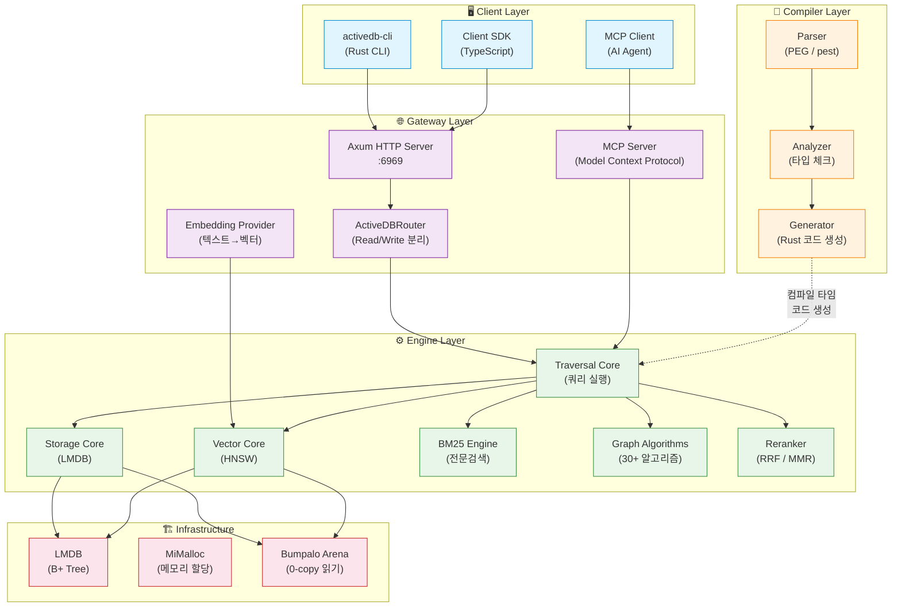
```mermaid
graph TB
    subgraph Client["🖥️ Client Layer"]
        CLI["activedb-cli<br/>(Rust CLI)"]
        SDK["Client SDK<br/>(TypeScript)"]
        MCP_Client["MCP Client<br/>(AI Agent)"]
    end

    subgraph Gateway["🌐 Gateway Layer"]
        HTTP["Axum HTTP Server<br/>:6969"]
        Router["ActiveDBRouter<br/>(Read/Write 분리)"]
        MCP_Server["MCP Server<br/>(Model Context Protocol)"]
        Embed["Embedding Provider<br/>(텍스트→벡터)"]
    end

    subgraph Engine["⚙️ Engine Layer"]
        Traversal["Traversal Core<br/>(쿼리 실행)"]
        Storage["Storage Core<br/>(LMDB)"]
        Vector["Vector Core<br/>(HNSW)"]
        BM25["BM25 Engine<br/>(전문검색)"]
        Algorithms["Graph Algorithms<br/>(30+ 알고리즘)"]
        Reranker["Reranker<br/>(RRF / MMR)"]
    end

    subgraph Compiler["🔧 Compiler Layer"]
        Parser["Parser<br/>(PEG / pest)"]
        Analyzer["Analyzer<br/>(타입 체크)"]
        Generator["Generator<br/>(Rust 코드 생성)"]
    end

    subgraph Infra["🏗️ Infrastructure"]
        LMDB["LMDB<br/>(B+ Tree)"]
        MiMalloc["MiMalloc<br/>(메모리 할당)"]
        Arena["Bumpalo Arena<br/>(0-copy 읽기)"]
    end

    CLI --> HTTP
    SDK --> HTTP
    MCP_Client --> MCP_Server
    HTTP --> Router
    Router --> Traversal
    MCP_Server --> Traversal
    Embed --> Vector

    Traversal --> Storage
    Traversal --> Vector
    Traversal --> BM25
    Traversal --> Algorithms
    Traversal --> Reranker

    Storage --> LMDB
    Storage --> Arena
    Vector --> LMDB
    Vector --> Arena

    Parser --> Analyzer --> Generator
    Generator -.->|"컴파일 타임<br/>코드 생성"| Traversal

    classDef client fill:#e1f5fe,stroke:#0288d1
    classDef gateway fill:#f3e5f5,stroke:#7b1fa2
    classDef engine fill:#e8f5e9,stroke:#388e3c
    classDef compiler fill:#fff3e0,stroke:#f57c00
    classDef infra fill:#fce4ec,stroke:#c62828

    class CLI,SDK,MCP_Client client
    class HTTP,Router,MCP_Server,Embed gateway
    class Traversal,Storage,Vector,BM25,Algorithms,Reranker engine
    class Parser,Analyzer,Generator compiler
    class LMDB,MiMalloc,Arena infra
```

---

## 2. Crate 의존 관계

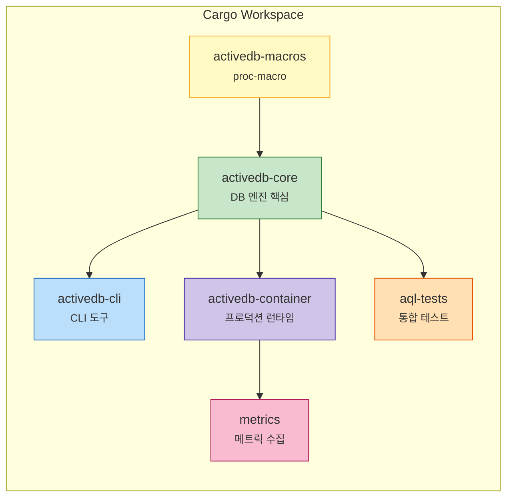
```mermaid
graph LR
    subgraph Workspace["Cargo Workspace"]
        macros["activedb-macros<br/><small>proc-macro</small>"]
        core["activedb-core<br/><small>DB 엔진 핵심</small>"]
        cli["activedb-cli<br/><small>CLI 도구</small>"]
        container["activedb-container<br/><small>프로덕션 런타임</small>"]
        tests["aql-tests<br/><small>통합 테스트</small>"]
        metrics_crate["metrics<br/><small>메트릭 수집</small>"]
    end

    macros --> core
    core --> cli
    core --> container
    core --> tests
    container --> metrics_crate

    style macros fill:#fff9c4,stroke:#f9a825
    style core fill:#c8e6c9,stroke:#2e7d32
    style cli fill:#bbdefb,stroke:#1565c0
    style container fill:#d1c4e9,stroke:#4527a0
    style tests fill:#ffe0b2,stroke:#e65100
    style metrics_crate fill:#f8bbd0,stroke:#ad1457
```

| crate | 역할 | 핵심 의존성 |
|-------|------|-------------|
| `activedb-macros` | 컴파일 타임 코드 생성 | syn, quote, proc-macro2 |
| `activedb-core` | DB 엔진 핵심 로직 | macros, lmdb, pest, mimalloc |
| `activedb-cli` | 사용자 CLI 인터페이스 | core, clap, reqwest, dialoguer |
| `activedb-container` | 배포된 인스턴스 런타임 | core |
| `aql-tests` | 쿼리 언어 통합 테스트 | core |
| `metrics` | 메트릭 수집/전송 | reqwest, serde |

---

## 3. 핵심 모듈 맵

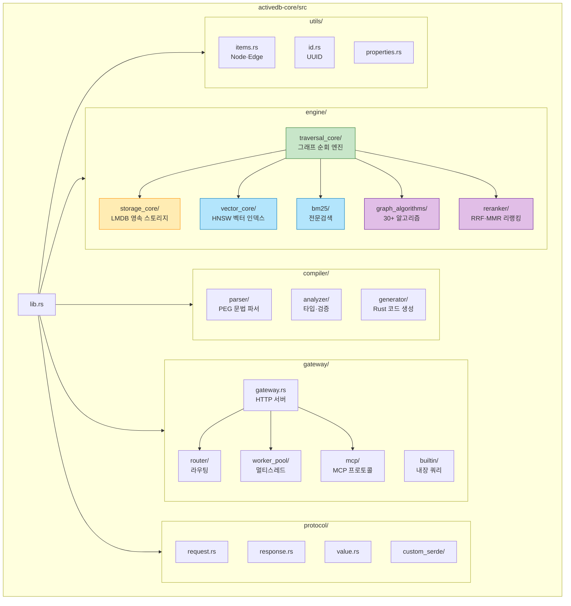
```mermaid
graph TB
    subgraph core["activedb-core/src"]
        lib["lib.rs"]

        subgraph engine["engine/"]
            sc["storage_core/<br/>LMDB 영속 스토리지"]
            tc["traversal_core/<br/>그래프 순회 엔진"]
            vc["vector_core/<br/>HNSW 벡터 인덱스"]
            bm["bm25/<br/>전문검색"]
            ga["graph_algorithms/<br/>30+ 알고리즘"]
            rr["reranker/<br/>RRF·MMR 리랭킹"]
        end

        subgraph compiler["compiler/"]
            pa["parser/<br/>PEG 문법 파서"]
            an["analyzer/<br/>타입·검증"]
            ge["generator/<br/>Rust 코드 생성"]
        end

        subgraph gateway_mod["gateway/"]
            gw["gateway.rs<br/>HTTP 서버"]
            rt["router/<br/>라우팅"]
            wp["worker_pool/<br/>멀티스레드"]
            mc["mcp/<br/>MCP 프로토콜"]
            bi["builtin/<br/>내장 쿼리"]
        end

        subgraph protocol["protocol/"]
            req["request.rs"]
            res["response.rs"]
            val["value.rs"]
            cs["custom_serde/"]
        end

        subgraph utils_mod["utils/"]
            items["items.rs<br/>Node·Edge"]
            id["id.rs<br/>UUID"]
            props["properties.rs"]
        end
    end

    lib --> engine
    lib --> compiler
    lib --> gateway_mod
    lib --> protocol
    lib --> utils_mod

    tc --> sc
    tc --> vc
    tc --> bm
    tc --> ga
    tc --> rr
    gw --> rt
    gw --> wp
    gw --> mc

    classDef storage fill:#ffecb3,stroke:#ff8f00
    classDef traversal fill:#c8e6c9,stroke:#2e7d32
    classDef vector fill:#b3e5fc,stroke:#0277bd
    classDef algo fill:#e1bee7,stroke:#6a1b9a

    class sc storage
    class tc traversal
    class vc,bm vector
    class ga,rr algo
```

---

## 4. 데이터 흐름 파이프라인

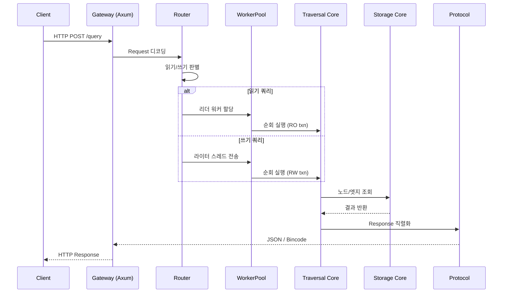
```mermaid
sequenceDiagram
    participant C as Client
    participant G as Gateway (Axum)
    participant R as Router
    participant WP as WorkerPool
    participant T as Traversal Core
    participant S as Storage Core
    participant P as Protocol

    C->>G: HTTP POST /query
    G->>R: Request 디코딩
    R->>R: 읽기/쓰기 판별

    alt 읽기 쿼리
        R->>WP: 리더 워커 할당
        WP->>T: 순회 실행 (RO txn)
    else 쓰기 쿼리
        R->>WP: 라이터 스레드 전송
        WP->>T: 순회 실행 (RW txn)
    end

    T->>S: 노드/엣지 조회
    S-->>T: 결과 반환
    T->>P: Response 직렬화
    P-->>G: JSON / Bincode
    G-->>C: HTTP Response
```

---

## 5. 읽기/쓰기 동시성 모델

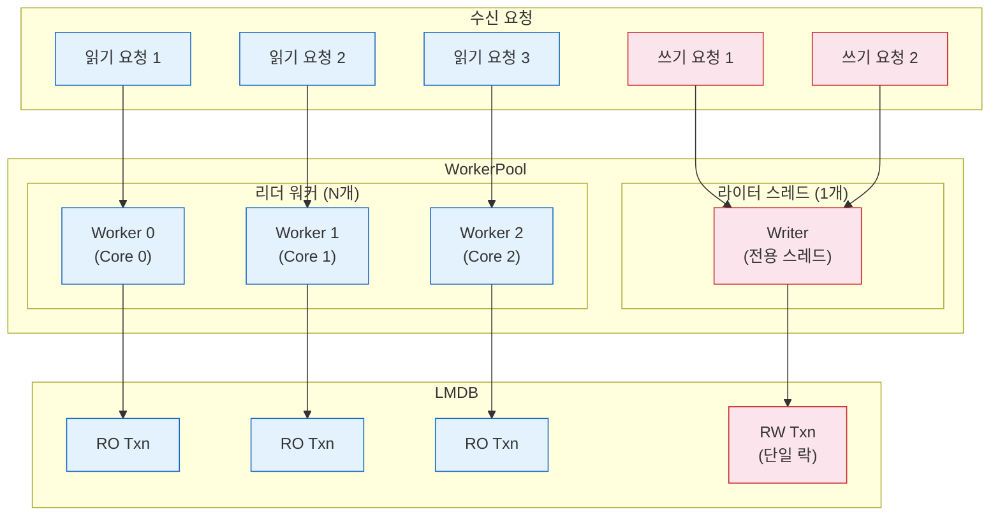
```mermaid
graph TB
    subgraph Incoming["수신 요청"]
        R1["읽기 요청 1"]
        R2["읽기 요청 2"]
        R3["읽기 요청 3"]
        W1["쓰기 요청 1"]
        W2["쓰기 요청 2"]
    end

    subgraph WorkerPool["WorkerPool"]
        subgraph Readers["리더 워커 (N개)"]
            RW1["Worker 0<br/>(Core 0)"]
            RW2["Worker 1<br/>(Core 1)"]
            RW3["Worker 2<br/>(Core 2)"]
        end
        subgraph Writer["라이터 스레드 (1개)"]
            WW["Writer<br/>(전용 스레드)"]
        end
    end

    subgraph LMDB_Layer["LMDB"]
        RO1["RO Txn"]
        RO2["RO Txn"]
        RO3["RO Txn"]
        RW_Txn["RW Txn<br/>(단일 락)"]
    end

    R1 --> RW1 --> RO1
    R2 --> RW2 --> RO2
    R3 --> RW3 --> RO3
    W1 --> WW
    W2 --> WW
    WW --> RW_Txn

    classDef read fill:#e3f2fd,stroke:#1565c0
    classDef write fill:#fce4ec,stroke:#c62828

    class R1,R2,R3,RW1,RW2,RW3,RO1,RO2,RO3 read
    class W1,W2,WW,RW_Txn write
```

> **핵심**: LMDB는 다수 읽기 트랜잭션 + 단일 쓰기 트랜잭션을 지원합니다.
> WorkerPool이 이를 활용하여 읽기는 병렬, 쓰기는 직렬화합니다.

---

## 6. 스토리지 아키텍처

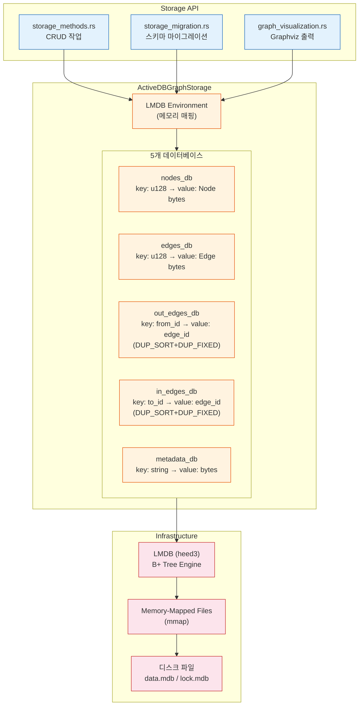
```mermaid
graph TB
    subgraph API["Storage API"]
        Methods["storage_methods.rs<br/>CRUD 작업"]
        Migration["storage_migration.rs<br/>스키마 마이그레이션"]
        Viz["graph_visualization.rs<br/>Graphviz 출력"]
    end

    subgraph Core["ActiveDBGraphStorage"]
        ENV["LMDB Environment<br/>(메모리 매핑)"]

        subgraph Tables["5개 데이터베이스"]
            nodes["nodes_db<br/>key: u128 → value: Node bytes"]
            edges["edges_db<br/>key: u128 → value: Edge bytes"]
            out["out_edges_db<br/>key: from_id → value: edge_id<br/>(DUP_SORT+DUP_FIXED)"]
            in_["in_edges_db<br/>key: to_id → value: edge_id<br/>(DUP_SORT+DUP_FIXED)"]
            meta["metadata_db<br/>key: string → value: bytes"]
        end
    end

    subgraph Infra_Layer["Infrastructure"]
        LMDB_Lib["LMDB (heed3)<br/>B+ Tree Engine"]
        MemMap["Memory-Mapped Files<br/>(mmap)"]
        Disk["디스크 파일<br/>data.mdb / lock.mdb"]
    end

    Methods --> ENV
    Migration --> ENV
    Viz --> ENV
    ENV --> Tables
    Tables --> LMDB_Lib --> MemMap --> Disk

    classDef api fill:#e3f2fd,stroke:#1565c0
    classDef core fill:#fff3e0,stroke:#e65100
    classDef infra fill:#fce4ec,stroke:#c62828

    class Methods,Migration,Viz api
    class ENV,nodes,edges,out,in_,meta core
    class LMDB_Lib,MemMap,Disk infra
```

### DUP_SORT + DUP_FIXED 인접 리스트 최적화

| 특성 | 설명 |
|------|------|
| **공간 효율** | 키를 한 번만 저장, 값(edge_id)만 중복 |
| **고정 크기** | DUP_FIXED로 u128(16바이트) 고정 → B+ 트리 최적화 |
| **범위 순회** | 한 노드의 모든 엣지를 연속 메모리에서 순회 |
| **제로카피** | mmap으로 디스크에서 직접 읽기, 복사 없음 |

---

## 7. 데이터 모델

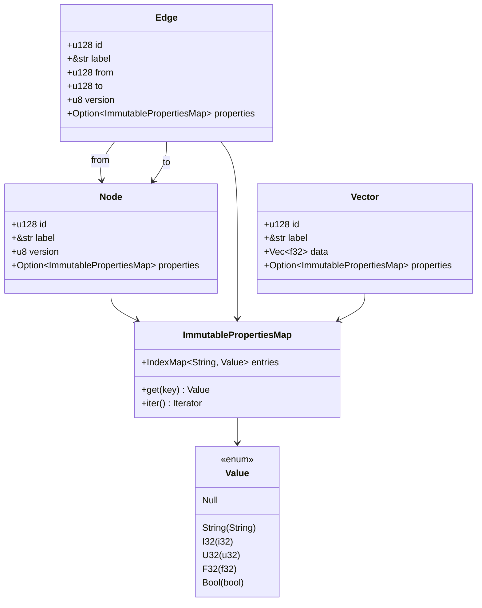
```mermaid
classDiagram
    class Node {
        +u128 id
        +&str label
        +u8 version
        +Option~ImmutablePropertiesMap~ properties
    }

    class Edge {
        +u128 id
        +&str label
        +u128 from
        +u128 to
        +u8 version
        +Option~ImmutablePropertiesMap~ properties
    }

    class Vector {
        +u128 id
        +&str label
        +Vec~f32~ data
        +Option~ImmutablePropertiesMap~ properties
    }

    class ImmutablePropertiesMap {
        +IndexMap~String, Value~ entries
        +get(key) Value
        +iter() Iterator
    }

    class Value {
        <<enum>>
        String(String)
        I32(i32)
        U32(u32)
        F32(f32)
        Bool(bool)
        Null
    }

    Node --> ImmutablePropertiesMap
    Edge --> ImmutablePropertiesMap
    Vector --> ImmutablePropertiesMap
    ImmutablePropertiesMap --> Value

    Edge --> Node : from
    Edge --> Node : to
```

---

## 8. LMDB 테이블 스키마

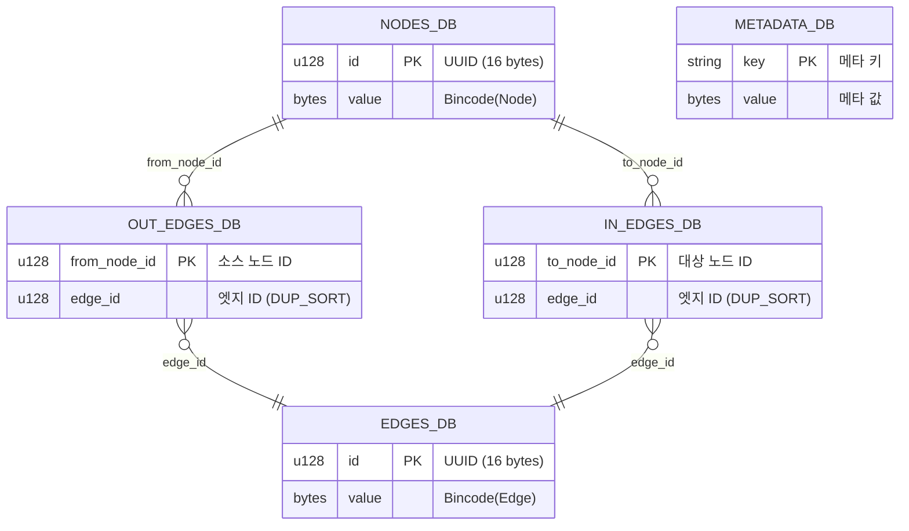
```mermaid
erDiagram
    NODES_DB {
        u128 id PK "UUID (16 bytes)"
        bytes value "Bincode(Node)"
    }

    EDGES_DB {
        u128 id PK "UUID (16 bytes)"
        bytes value "Bincode(Edge)"
    }

    OUT_EDGES_DB {
        u128 from_node_id PK "소스 노드 ID"
        u128 edge_id "엣지 ID (DUP_SORT)"
    }

    IN_EDGES_DB {
        u128 to_node_id PK "대상 노드 ID"
        u128 edge_id "엣지 ID (DUP_SORT)"
    }

    METADATA_DB {
        string key PK "메타 키"
        bytes value "메타 값"
    }

    NODES_DB ||--o{ OUT_EDGES_DB : "from_node_id"
    NODES_DB ||--o{ IN_EDGES_DB : "to_node_id"
    OUT_EDGES_DB }o--|| EDGES_DB : "edge_id"
    IN_EDGES_DB }o--|| EDGES_DB : "edge_id"
```

---

## 9. 트랜잭션 모델

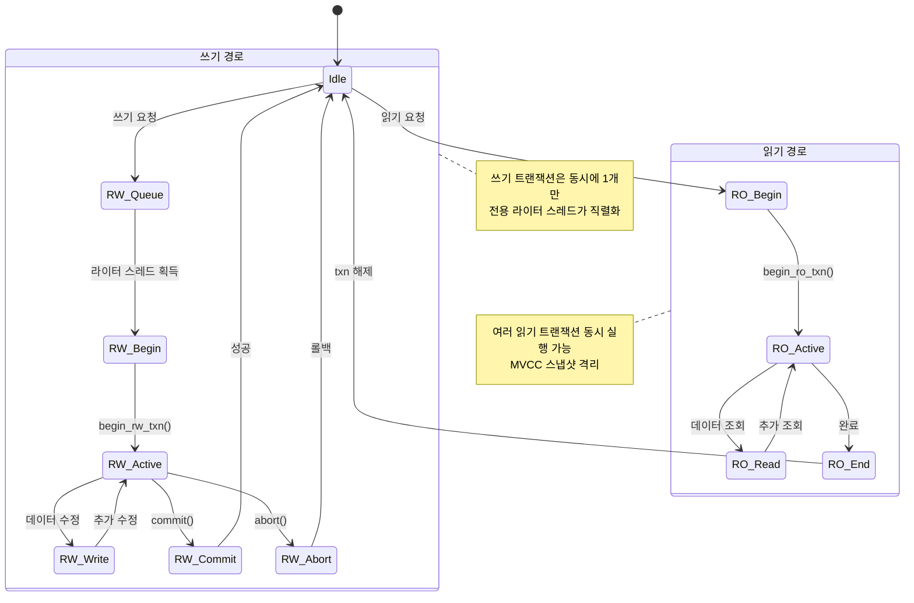
```mermaid
stateDiagram-v2
    [*] --> Idle

    state "읽기 경로" as ReadPath {
        Idle --> RO_Begin: 읽기 요청
        RO_Begin --> RO_Active: begin_ro_txn()
        RO_Active --> RO_Read: 데이터 조회
        RO_Read --> RO_Active: 추가 조회
        RO_Active --> RO_End: 완료
        RO_End --> Idle: txn 해제
    }

    state "쓰기 경로" as WritePath {
        Idle --> RW_Queue: 쓰기 요청
        RW_Queue --> RW_Begin: 라이터 스레드 획득
        RW_Begin --> RW_Active: begin_rw_txn()
        RW_Active --> RW_Write: 데이터 수정
        RW_Write --> RW_Active: 추가 수정
        RW_Active --> RW_Commit: commit()
        RW_Commit --> Idle: 성공
        RW_Active --> RW_Abort: abort()
        RW_Abort --> Idle: 롤백
    }

    note right of ReadPath
        여러 읽기 트랜잭션 동시 실행 가능
        MVCC 스냅샷 격리
    end note

    note right of WritePath
        쓰기 트랜잭션은 동시에 1개만
        전용 라이터 스레드가 직렬화
    end note
```

---

## 10. 메모리 아키텍처

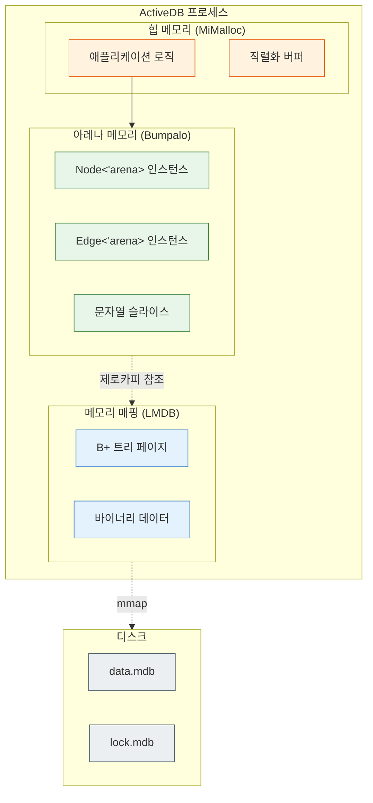
```mermaid
graph TB
    subgraph Process["ActiveDB 프로세스"]
        subgraph Heap["힙 메모리 (MiMalloc)"]
            App["애플리케이션 로직"]
            Serde["직렬화 버퍼"]
        end

        subgraph Arena_Mem["아레나 메모리 (Bumpalo)"]
            NodeArena["Node&lt;'arena&gt; 인스턴스"]
            EdgeArena["Edge&lt;'arena&gt; 인스턴스"]
            StrArena["문자열 슬라이스"]
        end

        subgraph MMap["메모리 매핑 (LMDB)"]
            Pages["B+ 트리 페이지"]
            Data["바이너리 데이터"]
        end
    end

    subgraph DiskLayer["디스크"]
        MDB["data.mdb"]
        Lock["lock.mdb"]
    end

    App --> Arena_Mem
    Arena_Mem -.->|"제로카피 참조"| MMap
    MMap -.->|"mmap"| DiskLayer

    classDef heap fill:#fff3e0,stroke:#e65100
    classDef arena fill:#e8f5e9,stroke:#2e7d32
    classDef mmap fill:#e3f2fd,stroke:#1565c0
    classDef disk fill:#eceff1,stroke:#455a64

    class App,Serde heap
    class NodeArena,EdgeArena,StrArena arena
    class Pages,Data mmap
    class MDB,Lock disk
```

### 읽기 경로의 제로카피 흐름

1. LMDB가 mmap으로 디스크 데이터를 가상 메모리에 매핑
2. Bumpalo 아레나에 `Node<'arena>` 구조체 할당
3. 문자열/속성은 mmap 메모리를 직접 참조 (복사 없음)
4. 아레나는 요청 완료 시 한 번에 해제 → GC 부담 없음

---

## 11. AQL 컴파일러 파이프라인

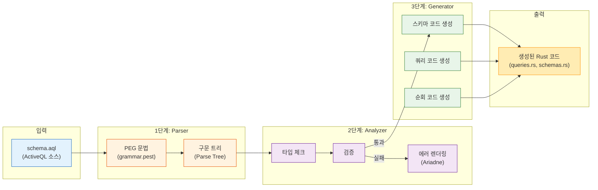
```mermaid
graph LR
    subgraph Input["입력"]
        AQL["schema.aql<br/>(ActiveQL 소스)"]
    end

    subgraph Parser_Stage["1단계: Parser"]
        PEG["PEG 문법<br/>(grammar.pest)"]
        AST["구문 트리<br/>(Parse Tree)"]
    end

    subgraph Analyzer_Stage["2단계: Analyzer"]
        TypeCheck["타입 체크"]
        Validate["검증"]
        ErrorRender["에러 렌더링<br/>(Ariadne)"]
    end

    subgraph Generator_Stage["3단계: Generator"]
        SchemaGen["스키마 코드 생성"]
        QueryGen["쿼리 코드 생성"]
        TraversalGen["순회 코드 생성"]
    end

    subgraph Output["출력"]
        RustCode["생성된 Rust 코드<br/>(queries.rs, schemas.rs)"]
    end

    AQL --> PEG --> AST
    AST --> TypeCheck --> Validate
    Validate -->|"통과"| SchemaGen
    Validate -->|"실패"| ErrorRender
    SchemaGen --> RustCode
    QueryGen --> RustCode
    TraversalGen --> RustCode

    classDef input fill:#e3f2fd,stroke:#1565c0
    classDef parser fill:#fff3e0,stroke:#e65100
    classDef analyzer fill:#f3e5f5,stroke:#6a1b9a
    classDef generator fill:#e8f5e9,stroke:#2e7d32
    classDef output fill:#ffecb3,stroke:#ff8f00

    class AQL input
    class PEG,AST parser
    class TypeCheck,Validate,ErrorRender analyzer
    class SchemaGen,QueryGen,TraversalGen generator
    class RustCode output
```

---

## 12. PEG 문법 구조

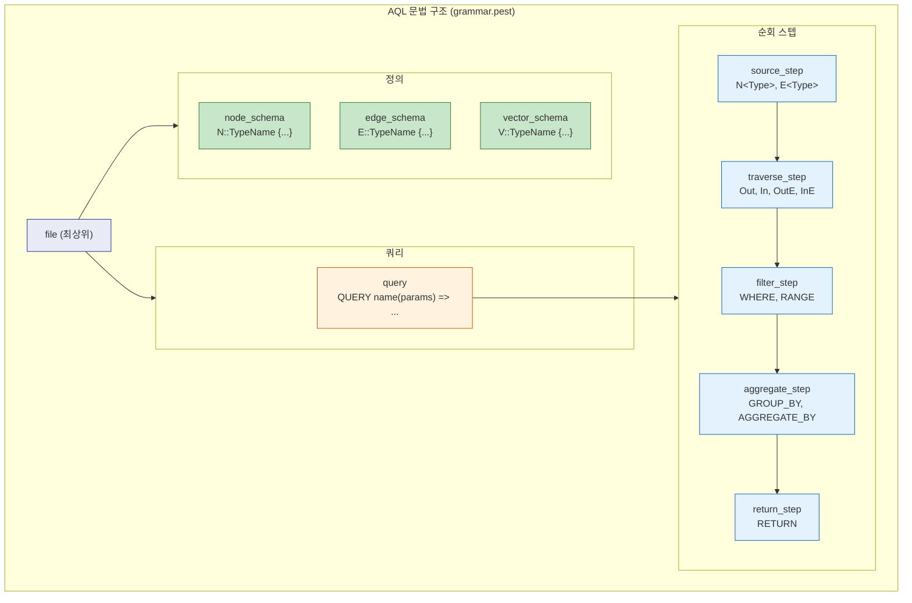
```mermaid
graph TB
    subgraph Grammar["AQL 문법 구조 (grammar.pest)"]
        File["file (최상위)"]

        subgraph Definitions["정의"]
            NodeDef["node_schema<br/>N::TypeName {...}"]
            EdgeDef["edge_schema<br/>E::TypeName {...}"]
            VectorDef["vector_schema<br/>V::TypeName {...}"]
        end

        subgraph Queries["쿼리"]
            QueryDef["query<br/>QUERY name(params) => ..."]
        end

        subgraph Steps["순회 스텝"]
            SourceStep["source_step<br/>N&lt;Type&gt;, E&lt;Type&gt;"]
            TraverseStep["traverse_step<br/>Out, In, OutE, InE"]
            FilterStep["filter_step<br/>WHERE, RANGE"]
            AggregateStep["aggregate_step<br/>GROUP_BY, AGGREGATE_BY"]
            ReturnStep["return_step<br/>RETURN"]
        end
    end

    File --> Definitions
    File --> Queries
    QueryDef --> Steps
    SourceStep --> TraverseStep --> FilterStep --> AggregateStep --> ReturnStep

    classDef top fill:#e8eaf6,stroke:#283593
    classDef def fill:#c8e6c9,stroke:#2e7d32
    classDef query fill:#fff3e0,stroke:#e65100
    classDef step fill:#e3f2fd,stroke:#1565c0

    class File top
    class NodeDef,EdgeDef,VectorDef def
    class QueryDef query
    class SourceStep,TraverseStep,FilterStep,AggregateStep,ReturnStep step
```

### 스키마 정의 문법 예시

```
N::User {                    -- 노드 스키마
    INDEX name: String,      -- 인덱스 필드
    age: U32,                -- 일반 필드
    email: String
}

E::Follows {                 -- 엣지 스키마
    From: User,              -- 소스 노드 타입
    To: User,                -- 대상 노드 타입
    Properties: {
        since: String,       -- 엣지 속성
        weight: F32
    }
}

V::Document {                -- 벡터 스키마
    INDEX title: String,     -- BM25 대상
    content: String,
    embedding: Vector        -- 벡터 필드
}
```

---

## 13. 분석기 검증 과정

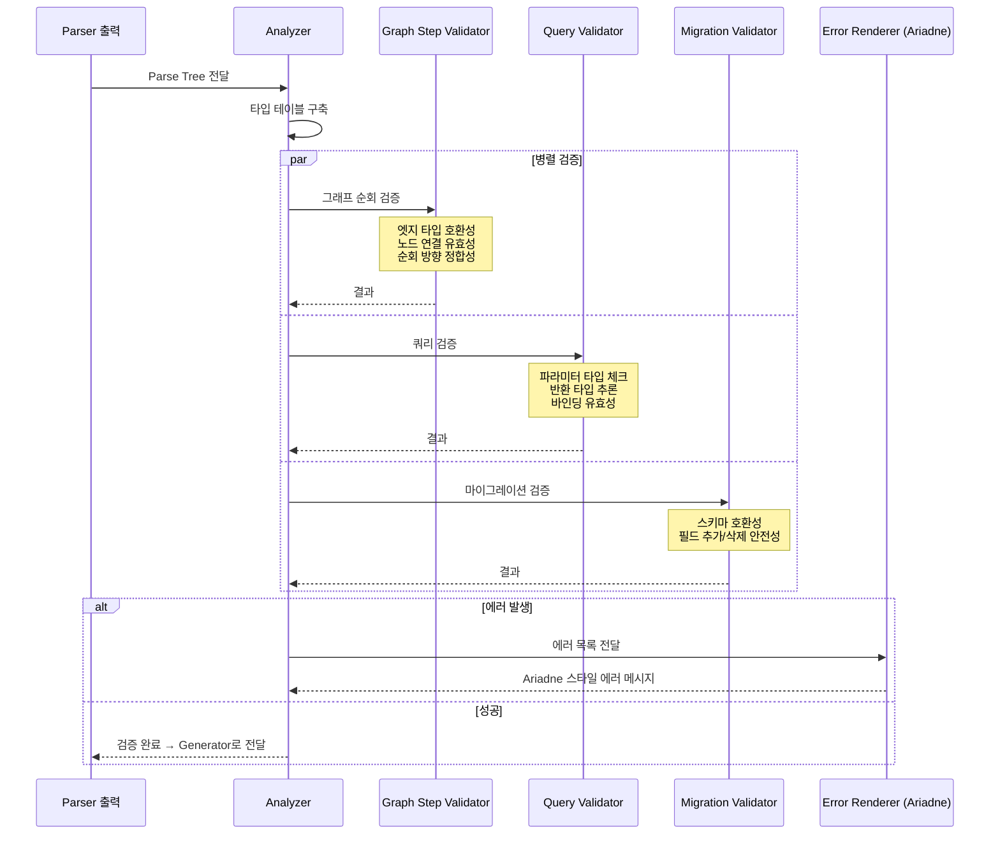
```mermaid
sequenceDiagram
    participant P as Parser 출력
    participant A as Analyzer
    participant GV as Graph Step Validator
    participant QV as Query Validator
    participant MV as Migration Validator
    participant E as Error Renderer (Ariadne)

    P->>A: Parse Tree 전달
    A->>A: 타입 테이블 구축

    par 병렬 검증
        A->>GV: 그래프 순회 검증
        Note over GV: 엣지 타입 호환성<br/>노드 연결 유효성<br/>순회 방향 정합성
        GV-->>A: 결과
    and
        A->>QV: 쿼리 검증
        Note over QV: 파라미터 타입 체크<br/>반환 타입 추론<br/>바인딩 유효성
        QV-->>A: 결과
    and
        A->>MV: 마이그레이션 검증
        Note over MV: 스키마 호환성<br/>필드 추가/삭제 안전성
        MV-->>A: 결과
    end

    alt 에러 발생
        A->>E: 에러 목록 전달
        E-->>A: Ariadne 스타일 에러 메시지
    else 성공
        A-->>P: 검증 완료 → Generator로 전달
    end
```

### 에러 코드 체계

| 코드 | 카테고리 | 설명 |
|------|----------|------|
| E001 | Type | 타입 불일치 |
| E002 | Type | 알 수 없는 타입 |
| E003 | Schema | 중복 필드 정의 |
| E004 | Schema | 필수 필드 누락 (From/To) |
| E005 | Query | 바인딩되지 않은 변수 |
| E006 | Query | 유효하지 않은 순회 스텝 |
| E007 | Graph | 엣지 방향 불일치 |
| E008 | Graph | 존재하지 않는 노드/엣지 타입 |
| E009 | Migration | 호환 불가능한 타입 변경 |
| E010 | Migration | 인덱스 필드 삭제 불가 |

---

## 14. 코드 생성기

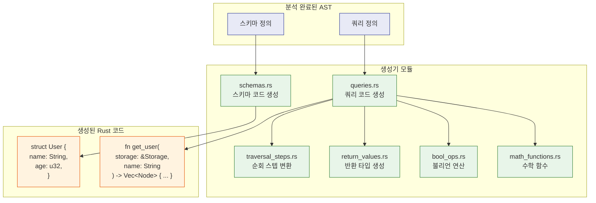
```mermaid
graph TB
    subgraph Input_Gen["분석 완료된 AST"]
        Schemas_AST["스키마 정의"]
        Queries_AST["쿼리 정의"]
    end

    subgraph Generators["생성기 모듈"]
        SG["schemas.rs<br/>스키마 코드 생성"]
        QG["queries.rs<br/>쿼리 코드 생성"]
        TG["traversal_steps.rs<br/>순회 스텝 변환"]
        RV["return_values.rs<br/>반환 타입 생성"]
        BO["bool_ops.rs<br/>불리언 연산"]
        MF["math_functions.rs<br/>수학 함수"]
    end

    subgraph Output_Gen["생성된 Rust 코드"]
        StructCode["struct User {<br/>  name: String,<br/>  age: u32,<br/>}"]
        QueryCode["fn get_user(<br/>  storage: &Storage,<br/>  name: String<br/>) -> Vec&lt;Node&gt; { ... }"]
    end

    Schemas_AST --> SG --> StructCode
    Queries_AST --> QG --> QueryCode
    QG --> TG
    QG --> RV
    QG --> BO
    QG --> MF

    classDef ast fill:#e8eaf6,stroke:#283593
    classDef gen fill:#e8f5e9,stroke:#2e7d32
    classDef code fill:#fff3e0,stroke:#e65100

    class Schemas_AST,Queries_AST ast
    class SG,QG,TG,RV,BO,MF gen
    class StructCode,QueryCode code
```

### AQL → 순회 파이프라인 변환 예시

입력 AQL:
```
QUERY getFollowers(user_name: String) =>
    user <- N<User>({name: user_name})
    followers <- user.In<Follows>.FromN
    active <- followers.WHERE({age: > 18})
    RETURN active.ORDER(age, DESC).RANGE(0, 10)
```

생성되는 파이프라인:

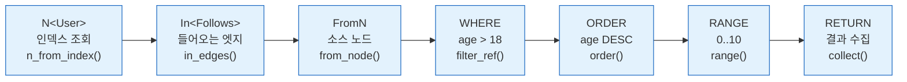
```mermaid
graph LR
    S1["N&lt;User&gt;<br/>인덱스 조회<br/>n_from_index()"]
    S2["In&lt;Follows&gt;<br/>들어오는 엣지<br/>in_edges()"]
    S3["FromN<br/>소스 노드<br/>from_node()"]
    S4["WHERE<br/>age > 18<br/>filter_ref()"]
    S5["ORDER<br/>age DESC<br/>order()"]
    S6["RANGE<br/>0..10<br/>range()"]
    S7["RETURN<br/>결과 수집<br/>collect()"]

    S1 --> S2 --> S3 --> S4 --> S5 --> S6 --> S7

    classDef step fill:#e3f2fd,stroke:#1565c0
    class S1,S2,S3,S4,S5,S6,S7 step
```

---

## 15. 그래프 순회 파이프라인

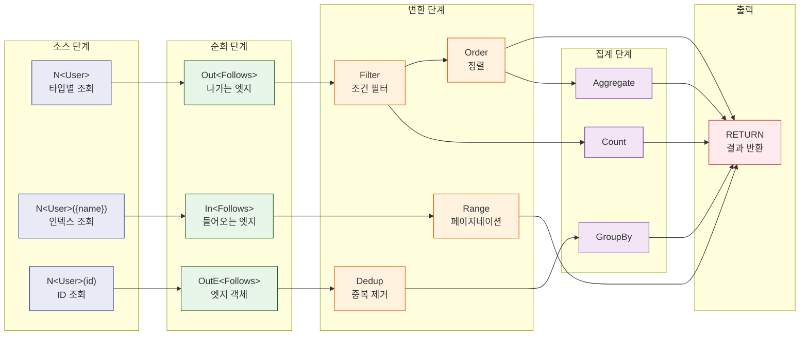
```mermaid
graph LR
    subgraph Source["소스 단계"]
        NType["N&lt;User&gt;<br/>타입별 조회"]
        NIndex["N&lt;User&gt;({name})<br/>인덱스 조회"]
        NId["N&lt;User&gt;(id)<br/>ID 조회"]
    end

    subgraph Traverse["순회 단계"]
        Out["Out&lt;Follows&gt;<br/>나가는 엣지"]
        In["In&lt;Follows&gt;<br/>들어오는 엣지"]
        OutE["OutE&lt;Follows&gt;<br/>엣지 객체"]
    end

    subgraph Transform["변환 단계"]
        Filter["Filter<br/>조건 필터"]
        Order["Order<br/>정렬"]
        Range["Range<br/>페이지네이션"]
        Dedup["Dedup<br/>중복 제거"]
    end

    subgraph Aggregate_Stage["집계 단계"]
        Count["Count"]
        GroupBy["GroupBy"]
        Aggregate["Aggregate"]
    end

    subgraph Output["출력"]
        Return["RETURN<br/>결과 반환"]
    end

    NType --> Out --> Filter --> Order --> Return
    NIndex --> In --> Range --> Return
    NId --> OutE --> Dedup --> GroupBy --> Return
    Filter --> Count --> Return
    Order --> Aggregate --> Return

    classDef source fill:#e8eaf6,stroke:#283593
    classDef traverse fill:#e8f5e9,stroke:#1b5e20
    classDef transform fill:#fff3e0,stroke:#e65100
    classDef agg fill:#f3e5f5,stroke:#6a1b9a
    classDef output fill:#ffebee,stroke:#b71c1c

    class NType,NIndex,NId source
    class Out,In,OutE traverse
    class Filter,Order,Range,Dedup transform
    class Count,GroupBy,Aggregate agg
    class Return output
```

### 데이터 쓰기 흐름

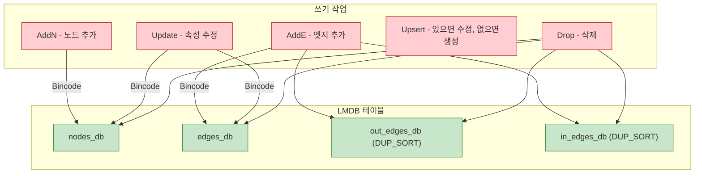
```mermaid
graph TB
    subgraph Write_Ops["쓰기 작업"]
        AddN["AddN - 노드 추가"]
        AddE["AddE - 엣지 추가"]
        Update["Update - 속성 수정"]
        Upsert["Upsert - 있으면 수정, 없으면 생성"]
        Drop["Drop - 삭제"]
    end

    subgraph LMDB_Tables["LMDB 테이블"]
        nodes["nodes_db"]
        edges["edges_db"]
        out_edges["out_edges_db (DUP_SORT)"]
        in_edges["in_edges_db (DUP_SORT)"]
    end

    AddN -->|"Bincode"| nodes
    AddE -->|"Bincode"| edges
    AddE --> out_edges
    AddE --> in_edges
    Update -->|"Bincode"| nodes
    Update -->|"Bincode"| edges
    Drop --> nodes
    Drop --> edges
    Drop --> out_edges
    Drop --> in_edges

    classDef write fill:#ffcdd2,stroke:#b71c1c
    classDef db fill:#c8e6c9,stroke:#2e7d32

    class AddN,AddE,Update,Upsert,Drop write
    class nodes,edges,out_edges,in_edges db
```

---

## 16. 그래프 알고리즘 카탈로그

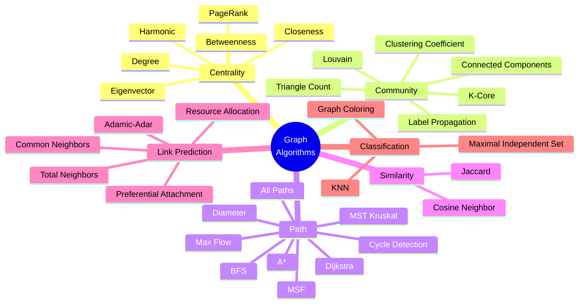
```mermaid
mindmap
  root((Graph<br/>Algorithms))
    Centrality
      PageRank
      Degree
      Betweenness
      Closeness
      Eigenvector
      Harmonic
    Community
      Louvain
      Label Propagation
      Connected Components
      K-Core
      Triangle Count
      Clustering Coefficient
    Path
      Dijkstra
      BFS
      A*
      All Paths
      Cycle Detection
      Max Flow
      MST Kruskal
      MSF
      Diameter
    Similarity
      Jaccard
      Cosine Neighbor
    Link Prediction
      Common Neighbors
      Adamic-Adar
      Preferential Attachment
      Resource Allocation
      Total Neighbors
    Classification
      KNN
      Graph Coloring
      Maximal Independent Set
```

### 중심성 알고리즘 (Centrality)

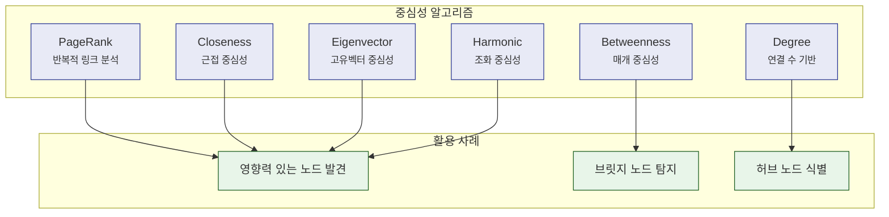
```mermaid
graph TB
    subgraph Centrality["중심성 알고리즘"]
        PR["PageRank<br/><small>반복적 링크 분석</small>"]
        DE["Degree<br/><small>연결 수 기반</small>"]
        BT["Betweenness<br/><small>매개 중심성</small>"]
        CL["Closeness<br/><small>근접 중심성</small>"]
        EV["Eigenvector<br/><small>고유벡터 중심성</small>"]
        HM["Harmonic<br/><small>조화 중심성</small>"]
    end

    subgraph Use_Cases["활용 사례"]
        Influence["영향력 있는 노드 발견"]
        Bridge["브릿지 노드 탐지"]
        Hub["허브 노드 식별"]
    end

    PR --> Influence
    DE --> Hub
    BT --> Bridge
    CL --> Influence
    EV --> Influence
    HM --> Influence

    classDef algo fill:#e8eaf6,stroke:#283593
    classDef use fill:#e8f5e9,stroke:#1b5e20

    class PR,DE,BT,CL,EV,HM algo
    class Influence,Bridge,Hub use
```

| 알고리즘 | 시간 복잡도 | 설명 |
|----------|-------------|------|
| **PageRank** | O(V+E) × iter | 반복적 확률 전파. 댐핑 팩터 d=0.85 |
| **Degree** | O(V) | in-degree + out-degree 합산 |
| **Betweenness** | O(V×E) | 모든 최단 경로 중 경유 비율 |
| **Closeness** | O(V×(V+E)) | 모든 노드까지 거리의 역수 |
| **Eigenvector** | O(V+E) × iter | 중요한 이웃에 연결될수록 높은 점수 |
| **Harmonic** | O(V×(V+E)) | 거리 역수의 합 (비연결 그래프 대응) |

### Louvain 커뮤니티 탐지

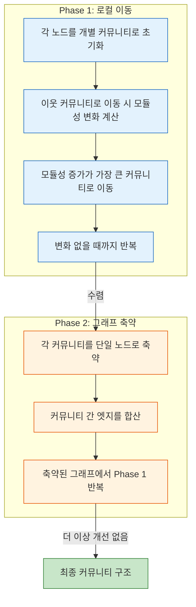
```mermaid
graph TB
    subgraph Phase1["Phase 1: 로컬 이동"]
        P1_1["각 노드를 개별 커뮤니티로 초기화"]
        P1_2["이웃 커뮤니티로 이동 시 모듈성 변화 계산"]
        P1_3["모듈성 증가가 가장 큰 커뮤니티로 이동"]
        P1_4["변화 없을 때까지 반복"]
    end

    subgraph Phase2["Phase 2: 그래프 축약"]
        P2_1["각 커뮤니티를 단일 노드로 축약"]
        P2_2["커뮤니티 간 엣지를 합산"]
        P2_3["축약된 그래프에서 Phase 1 반복"]
    end

    P1_1 --> P1_2 --> P1_3 --> P1_4
    P1_4 -->|"수렴"| P2_1 --> P2_2 --> P2_3
    P2_3 -->|"더 이상 개선 없음"| Final["최종 커뮤니티 구조"]

    classDef phase1 fill:#e3f2fd,stroke:#1565c0
    classDef phase2 fill:#fff3e0,stroke:#e65100
    classDef final fill:#c8e6c9,stroke:#2e7d32

    class P1_1,P1_2,P1_3,P1_4 phase1
    class P2_1,P2_2,P2_3 phase2
    class Final final
```

### 경로 알고리즘 비교

```mermaid
graph LR
    subgraph BFS_Search["BFS"]
        B_Start["시작"] --> B_L1["레벨 1"] --> B_L2["레벨 2"] --> B_End["도착"]
    end

    subgraph Dijkstra_Search["Dijkstra"]
        D_Start["시작"] --> D_Min["최소 비용 노드 선택"] --> D_Relax["엣지 완화"] --> D_End["도착"]
    end

    subgraph AStar_Search["A*"]
        A_Start["시작"] --> A_Score["f=g+h"] --> A_Best["최소 f 선택"] --> A_End["도착"]
    end
```

| 알고리즘 | 시간 복잡도 | 특징 |
|----------|-------------|------|
| BFS | O(V+E) | 비가중 최단경로 |
| Dijkstra | O((V+E)logV) | 가중 최단경로 |
| A* | O(E) ~ O(V²) | 휴리스틱 최단경로 |
| All Paths | O(2^V) 최악 | 모든 경로 열거 |
| Cycle Detection | O(V+E) | 사이클 존재 여부 |
| Max Flow | O(V×E²) | 최대 흐름 (Ford-Fulkerson) |
| MST (Kruskal) | O(E log E) | 최소 신장 트리 |

### 유사도 & 링크 예측

```mermaid
graph TB
    subgraph Similarity["유사도"]
        Jaccard["Jaccard: |A∩B| / |A∪B|"]
        Cosine["Cosine Neighbor: cos(A, B)"]
    end

    subgraph LinkPred["링크 예측"]
        CN["Common Neighbors: |N(x) ∩ N(y)|"]
        AA["Adamic-Adar: Σ 1/log|N(z)|"]
        PA["Preferential Attachment: |N(x)| × |N(y)|"]
        RA["Resource Allocation: Σ 1/|N(z)|"]
        TN["Total Neighbors: |N(x) ∪ N(y)|"]
    end

    subgraph App["활용"]
        Recommend["추천 시스템"]
        Missing["누락 링크 발견"]
        Similar["유사 노드 탐색"]
    end

    Jaccard --> Similar
    Cosine --> Similar
    CN --> Missing
    AA --> Recommend
    PA --> Recommend
    RA --> Missing
    TN --> Missing

    classDef sim fill:#b3e5fc,stroke:#0277bd
    classDef link fill:#c8e6c9,stroke:#2e7d32
    classDef app fill:#fff3e0,stroke:#e65100

    class Jaccard,Cosine sim
    class CN,AA,PA,RA,TN link
    class Recommend,Missing,Similar app
```

### 전체 알고리즘 매트릭스

| 카테고리 | 알고리즘 | 파일 | 출력 |
|----------|----------|------|------|
| **중심성** | PageRank | `pagerank.rs` | {node → score} |
| | Degree | `degree.rs` | {node → degree} |
| | Betweenness | `betweenness.rs` | {node → score} |
| | Closeness | `closeness.rs` | {node → score} |
| | Eigenvector | `eigenvector.rs` | {node → score} |
| | Harmonic | `harmonic.rs` | {node → score} |
| **커뮤니티** | Louvain | `louvain.rs` | {node → community_id} |
| | Label Propagation | `label_propagation.rs` | {node → label} |
| | Connected Components | `connected_components.rs` | {node → component_id} |
| | K-Core | `k_core.rs` | 서브그래프 |
| | Triangle Count | `triangle_count.rs` | 삼각형 수 |
| | Clustering Coefficient | `clustering_coefficient.rs` | {node → coefficient} |
| **경로** | Dijkstra | `shortest_path.rs` | 경로 + 비용 |
| | BFS | `bfs.rs` | 최단 경로 |
| | A* | `astar.rs` | 최단 경로 |
| | All Paths | `all_paths.rs` | 경로 목록 |
| | Cycle Detection | `cycle_detection.rs` | 사이클 여부 |
| | Max Flow | `max_flow.rs` | 최대 흐름 값 |
| | MST | `mst.rs` | 최소 신장 트리 |
| | MSF | `msf.rs` | 최소 신장 포레스트 |
| | Diameter | `diameter.rs` | 최대 거리 |
| **유사도** | Jaccard | `jaccard.rs` | 유사도 점수 |
| | Cosine Neighbor | `cosine_neighbor.rs` | 유사도 점수 |
| **링크 예측** | Common Neighbors | `common_neighbors.rs` | 공통 이웃 수 |
| | Adamic-Adar | `adamic_adar.rs` | AA 점수 |
| | Preferential Attachment | `preferential_attachment.rs` | PA 점수 |
| | Resource Allocation | `resource_allocation.rs` | RA 점수 |
| | Total Neighbors | `total_neighbors.rs` | 전체 이웃 수 |
| **분류** | KNN | `knn.rs` | 분류 레이블 |
| | Graph Coloring | `graph_coloring.rs` | {node → color} |
| | Maximal Independent Set | `maximal_independent_set.rs` | 독립 집합 |

---

## 17. 벡터 검색 아키텍처 (HNSW)

```mermaid
graph TB
    subgraph Query["쿼리 입력"]
        Text["텍스트 쿼리"]
        Vec_Q["벡터 쿼리<br/>[0.12, 0.45, ...]"]
    end

    subgraph Embed_Layer["임베딩 레이어"]
        EP["Embedding Provider<br/>(외부 API)"]
    end

    subgraph SearchEngines["검색 엔진"]
        HNSW["HNSW Index<br/>(벡터 유사도)"]
        BM25_E["BM25 Engine<br/>(전문검색)"]
        BF["Brute Force<br/>(순차 검색)"]
    end

    subgraph Rerank["리랭킹"]
        RRF["RRF"]
        MMR["MMR"]
    end

    subgraph Results["결과"]
        Ranked["통합 랭킹 결과"]
    end

    Text --> EP --> Vec_Q
    Text --> BM25_E
    Vec_Q --> HNSW
    Vec_Q --> BF

    HNSW --> RRF
    BM25_E --> RRF
    HNSW --> MMR
    BM25_E --> MMR
    RRF --> Ranked
    MMR --> Ranked

    classDef query fill:#e3f2fd,stroke:#1565c0
    classDef embed fill:#fff9c4,stroke:#f57f17
    classDef search fill:#e8f5e9,stroke:#2e7d32
    classDef rerank fill:#f3e5f5,stroke:#6a1b9a
    classDef result fill:#ffecb3,stroke:#ff8f00

    class Text,Vec_Q query
    class EP embed
    class HNSW,BM25_E,BF search
    class RRF,MMR rerank
    class Ranked result
```

### HNSW 레이어 구조

```mermaid
graph TB
    subgraph HNSW_Layers["HNSW 레이어 구조"]
        L3["Layer 3 (최상위) — 노드 수: 소수, 장거리 연결"]
        L2["Layer 2"]
        L1["Layer 1"]
        L0["Layer 0 (최하위) — 모든 노드 포함, 조밀한 연결"]
    end

    subgraph Search_Process["검색 과정"]
        S1["1. 최상위 레이어 entry point 시작"]
        S2["2. 탐욕적 탐색 — 가장 가까운 이웃으로 이동"]
        S3["3. 하위 레이어로 내려감"]
        S4["4. Layer 0에서 K개 최근접 이웃 반환"]
    end

    L3 --> L2 --> L1 --> L0
    S1 --> S2 --> S3 --> S4

    L3 -.-> S1
    L0 -.-> S4

    classDef layer fill:#e8eaf6,stroke:#283593
    classDef search fill:#e8f5e9,stroke:#1b5e20

    class L3,L2,L1,L0 layer
    class S1,S2,S3,S4 search
```

| 파라미터 | 기본값 | 설명 |
|----------|--------|------|
| **M** | 16 | 각 노드의 최대 이웃 연결 수 |
| **ef_construction** | 200 | 인덱스 빌드 시 후보 목록 크기 |
| **ef_search** | 50 | 검색 시 후보 목록 크기 |
| **max_level** | log(N) | 최대 레이어 수 |

### AVX2 SIMD 벡터 거리 가속

```mermaid
graph LR
    subgraph Standard["일반 코사인 유사도"]
        S_Loop["for i in 0..dim:<br/>  dot += a[i]*b[i]"]
        S_Result["cos = dot / (‖a‖×‖b‖)"]
        S_Loop --> S_Result
    end

    subgraph SIMD["AVX2 SIMD 가속"]
        Load["_mm256_loadu_ps<br/>8개 float 동시 로드"]
        FMA["_mm256_fmadd_ps<br/>8개 FMA 동시"]
        Reduce["수평 합산"]
        Load --> FMA --> Reduce
    end

    subgraph Speedup["성능"]
        S_Speed["1x (기준)"]
        SIMD_Speed["~6-8x (AVX2)"]
    end

    S_Result --> S_Speed
    Reduce --> SIMD_Speed

    classDef std fill:#ffcdd2,stroke:#c62828
    classDef simd fill:#c8e6c9,stroke:#2e7d32

    class S_Loop,S_Result std
    class Load,FMA,Reduce simd
```

### 벡터 스토리지 구조

```mermaid
graph TB
    subgraph VectorCore["Vector Core"]
        HNSW_Index["HNSW Index (인메모리)"]
        VectorStore["Vector Store (LMDB 영속)"]
        BinaryHeap["Binary Heap (우선순위 큐)"]
    end

    subgraph Operations["작업"]
        Insert["Insert"]
        Search_Op["Search (ANN)"]
        BruteForce_Op["Brute Force"]
        FilterSearch["Filter Search"]
    end

    Insert --> HNSW_Index
    Insert --> VectorStore
    Search_Op --> HNSW_Index --> BinaryHeap
    BruteForce_Op --> VectorStore
    FilterSearch --> HNSW_Index

    VectorStore --> LMDB_V["LMDB"] --> Arena_V["Bumpalo Arena"]

    classDef core fill:#e8eaf6,stroke:#283593
    classDef ops fill:#e8f5e9,stroke:#2e7d32

    class HNSW_Index,VectorStore,BinaryHeap core
    class Insert,Search_Op,BruteForce_Op,FilterSearch ops
```

---

## 18. BM25 전문검색

```mermaid
graph TB
    subgraph Input_BM25["입력"]
        Query_BM25["검색 쿼리: 'graph database engine'"]
    end

    subgraph Tokenize["토큰화"]
        T1["'graph'"]
        T2["'database'"]
        T3["'engine'"]
    end

    subgraph Scoring["BM25 스코어링"]
        TF["TF (단어 빈도)"]
        IDF["IDF = log((N-n+0.5)/(n+0.5))"]
        DL["문서 길이 정규화: dl/avgdl"]
        BM25_Score["BM25 = Σ IDF × (TF×(k1+1)) / (TF+k1×(1-b+b×dl/avgdl))"]
    end

    subgraph Config_BM25["설정"]
        K1["k1=1.2 (TF 포화)"]
        B["b=0.75 (길이 정규화)"]
    end

    Query_BM25 --> Tokenize
    T1 --> TF
    T2 --> TF
    T3 --> TF
    TF --> BM25_Score
    IDF --> BM25_Score
    DL --> BM25_Score
    K1 --> BM25_Score
    B --> BM25_Score

    classDef input fill:#e3f2fd,stroke:#1565c0
    classDef token fill:#fff3e0,stroke:#e65100
    classDef score fill:#e8f5e9,stroke:#2e7d32

    class Query_BM25 input
    class T1,T2,T3 token
    class TF,IDF,DL,BM25_Score score
```

---

## 19. 하이브리드 리랭킹

### RRF (Reciprocal Rank Fusion)

```mermaid
graph TB
    subgraph Sources["검색 소스"]
        VR["벡터 결과<br/>1. DocA (0.95)<br/>2. DocC (0.87)<br/>3. DocB (0.82)"]
        BR["BM25 결과<br/>1. DocB (12.3)<br/>2. DocA (10.1)<br/>3. DocD (8.5)"]
    end

    subgraph RRF_Calc["RRF: score = Σ 1/(k + rank_i)"]
        DocA["DocA: 1/(60+1)+1/(60+2) = 0.0325"]
        DocB["DocB: 1/(60+3)+1/(60+1) = 0.0323"]
        DocC["DocC: 1/(60+2) = 0.0161"]
        DocD["DocD: 1/(60+3) = 0.0159"]
    end

    subgraph Final["최종 랭킹"]
        F1["1. DocA (0.0325)"]
        F2["2. DocB (0.0323)"]
        F3["3. DocC (0.0161)"]
        F4["4. DocD (0.0159)"]
    end

    VR --> DocA
    VR --> DocB
    VR --> DocC
    BR --> DocA
    BR --> DocB
    BR --> DocD

    DocA --> F1
    DocB --> F2
    DocC --> F3
    DocD --> F4

    classDef source fill:#e3f2fd,stroke:#1565c0
    classDef calc fill:#fff3e0,stroke:#e65100
    classDef final fill:#c8e6c9,stroke:#2e7d32

    class VR,BR source
    class DocA,DocB,DocC,DocD calc
    class F1,F2,F3,F4 final
```

### MMR (Maximal Marginal Relevance)

```mermaid
graph LR
    subgraph Formula["MMR 공식"]
        F["MMR = argmax<br/>λ×Sim(d,q) - (1-λ)×max Sim(d,d_sel)"]
    end

    subgraph Lambda["λ 파라미터"]
        High["λ→1.0: 관련성 우선"]
        Low["λ→0.0: 다양성 우선"]
    end

    subgraph Process["과정"]
        S1["1. 가장 관련 높은 문서 선택"]
        S2["2. 관련성 높으면서 기선택과 다른 것"]
        S3["3. K개까지 반복"]
    end

    S1 --> S2 --> S3
```

### AQL 검색 쿼리 예시

```
-- 벡터 검색
QUERY searchSimilar(query_text: String, k: I32) =>
    results <- SearchV<Document>(Embed(query_text), k)
    RETURN results

-- BM25 전문검색
QUERY fullTextSearch(query: String, k: I32) =>
    results <- SearchBM25<Document>(query, k)
    RETURN results

-- 하이브리드 (RRF)
QUERY hybridSearch(query: String, k: I32) =>
    results <- SearchV<Document>(Embed(query), k)
    reranked <- results::RerankRRF(k: k)
    RETURN reranked

-- 하이브리드 (MMR)
QUERY diverseSearch(query: String, k: I32) =>
    results <- SearchV<Document>(Embed(query), k)
    diverse <- results::RerankMMR(lambda: 0.7, distance: "cosine")
    RETURN diverse
```

---

## 20. Gateway & Worker Pool

```mermaid
graph TB
    subgraph Clients["클라이언트"]
        HTTP_Client["HTTP Client"]
        MCP_Agent["AI Agent (MCP)"]
        Dashboard["Web Dashboard"]
    end

    subgraph Gateway["ActiveDBGateway"]
        Axum["Axum HTTP Server :6969"]

        subgraph Routing["라우팅"]
            Router_GW["ActiveDBRouter"]
            ReadRoutes["읽기 라우트 /query/*"]
            WriteRoutes["쓰기 라우트 /mutate/*"]
            BuiltinRoutes["내장 라우트 /introspect, /nodes, /edges"]
        end

        subgraph Workers["워커 풀"]
            WP["WorkerPool"]
            R_Workers["리더 워커 ×N (코어 핀닝)"]
            W_Worker["라이터 ×1 (전용 스레드)"]
            Channel["Flume Channel (작업 큐)"]
        end
    end

    HTTP_Client --> Axum
    MCP_Agent --> Axum
    Dashboard --> Axum
    Axum --> Router_GW
    Router_GW --> ReadRoutes --> WP
    Router_GW --> WriteRoutes --> WP
    Router_GW --> BuiltinRoutes
    WP --> R_Workers
    WP --> W_Worker
    WP --> Channel

    classDef client fill:#e3f2fd,stroke:#1565c0
    classDef routing fill:#fff3e0,stroke:#e65100
    classDef worker fill:#e8f5e9,stroke:#2e7d32

    class HTTP_Client,MCP_Agent,Dashboard client
    class Router_GW,ReadRoutes,WriteRoutes,BuiltinRoutes routing
    class WP,R_Workers,W_Worker,Channel worker
```

### 코어 어피니티 배치

```mermaid
graph LR
    subgraph CPU["CPU 코어"]
        C0["Core 0"]
        C1["Core 1"]
        C2["Core 2"]
        C3["Core 3"]
        C4["Core 4"]
        C5["Core 5"]
    end

    subgraph Assignment["워커 할당"]
        W0["Reader 0"] --> C0
        W1["Reader 1"] --> C1
        W2["Reader 2"] --> C2
        W3["Reader 3"] --> C3
        WR["Writer"] --> C4
        TK["Tokio Runtime"] --> C5
    end

    classDef reader fill:#c8e6c9,stroke:#2e7d32
    classDef writer fill:#ffcdd2,stroke:#c62828
    classDef runtime fill:#e3f2fd,stroke:#1565c0

    class W0,W1,W2,W3 reader
    class WR writer
    class TK runtime
```

### 내장 엔드포인트

| 엔드포인트 | 설명 |
|------------|------|
| `GET /builtin/all_nodes_and_edges` | 전체 노드·엣지 조회 |
| `GET /builtin/node/:id` | ID로 노드 조회 |
| `GET /builtin/nodes/:label` | 레이블별 노드 목록 |
| `GET /builtin/node/:id/connections` | 노드의 연결 관계 |
| `GET /introspect/schema` | 스키마 인트로스펙션 |

### 요청/응답 프로토콜

```mermaid
classDiagram
    class Request {
        +String name
        +RequestType type
        +Value body
        +Vec~Format~ formats
    }

    class RequestType {
        <<enum>>
        Query
        MCP
    }

    class Response {
        +Value body
        +Format format
    }

    class Format {
        <<enum>>
        JSON
        Bincode
    }

    class GraphError {
        <<enum>>
        StorageError
        TraversalError
        VectorError
        EmbeddingError
        RerankerError
        DuplicateKey
        AlgorithmError
    }

    Request --> RequestType
    Request --> Format
    Response --> Format
```

---

## 21. MCP 서버

```mermaid
sequenceDiagram
    participant AI as AI Agent (Claude 등)
    participant MCP as MCP Server
    participant GW as Gateway
    participant DB as Engine

    AI->>MCP: tool_call: query_graph
    MCP->>GW: 내부 Request 변환
    GW->>DB: 순회 실행
    DB-->>GW: 결과
    GW-->>MCP: Response
    MCP-->>AI: tool_result: {nodes, edges}

    Note over AI,DB: AI 에이전트가 세션 기반으로<br/>그래프 데이터에 직접 접근
```

MCP 도구:
- `query_graph`: AQL 쿼리 실행
- `get_schema`: 스키마 조회
- `search_vectors`: 벡터 검색

---

## 22. 배포 아키텍처

```mermaid
graph TB
    subgraph Dev["개발 환경"]
        AQL_File["schema.aql"]
        CLIDev["activedb build"]
    end

    subgraph Build["빌드 파이프라인"]
        Compile["AQL 컴파일러 → Rust 코드"]
        Cargo["cargo build --release"]
        Docker["Docker 이미지 빌드"]
    end

    subgraph Deploy["배포 대상"]
        Local["로컬 Docker"]
        Fly["Fly.io"]
        ECR["AWS ECR"]
        GCP_Deploy["GCP"]
        Cloud["ActiveDB Cloud (매니지드)"]
    end

    AQL_File --> CLIDev --> Compile --> Cargo --> Docker
    Docker --> Local
    Docker --> Fly
    Docker --> ECR
    Docker --> GCP_Deploy
    Docker --> Cloud

    classDef dev fill:#e8eaf6,stroke:#283593
    classDef build fill:#fff3e0,stroke:#e65100
    classDef deploy fill:#e8f5e9,stroke:#1b5e20

    class AQL_File,CLIDev dev
    class Compile,Cargo,Docker build
    class Local,Fly,ECR,GCP_Deploy,Cloud deploy
```

### CLI 명령어

| 명령어 | 설명 |
|--------|------|
| `activedb init` | 새 프로젝트 생성 |
| `activedb check` | 타입 검증 |
| `activedb compile` | AQL → Rust 컴파일 |
| `activedb build` | 최종 빌드 |
| `activedb start/stop/restart` | 로컬 인스턴스 관리 |
| `activedb push <env>` | 클라우드 배포 |
| `activedb logs` | 로그 조회 (TUI) |
| `activedb status` | 상태 확인 |
| `activedb auth` | GitHub OAuth |
| `activedb backup` | 데이터 백업 |
| `activedb dashboard` | 웹 대시보드 |
| `activedb migrate` | 스키마 마이그레이션 |

---

## 23. 기술 스택 요약

| 레이어 | 기술 | 역할 |
|--------|------|------|
| **언어** | Rust 2024 Edition | 메모리 안전 + 고성능 |
| **스토리지** | LMDB (heed3) | 제로카피 B+ 트리 |
| **메모리** | MiMalloc + Bumpalo | 전역 할당기 + 아레나 |
| **벡터** | HNSW (자체 구현) | ANN 근사 검색 |
| **검색** | BM25 (자체 구현) | 전문검색 스코어링 |
| **파서** | pest (PEG) | ActiveQL 문법 파싱 |
| **HTTP** | Axum 0.8 | 비동기 HTTP 서버 |
| **비동기** | Tokio | 비동기 런타임 |
| **직렬화** | serde + sonic-rs + bincode | JSON/바이너리 직렬화 |
| **병렬화** | Rayon + core_affinity | 데이터 병렬 + 코어 핀닝 |
| **CLI** | Clap 4 | 커맨드라인 인터페이스 |
| **벡터 가속** | AVX2 SIMD | 코사인 거리 가속 |
| **클라우드** | Next.js + Drizzle ORM | 매니지드 서비스 웹 |

### 설계 원칙

1. **제로카피 우선** — LMDB 매핑 + Bumpalo 아레나로 불필요한 복사 최소화
2. **컴파일 타임 안전성** — AQL → Rust 코드 생성으로 런타임 타입 오류 방지
3. **단일 바이너리 배포** — 모든 기능이 하나의 컨테이너 이미지에 포함
4. **읽기/쓰기 분리** — 전용 라이터 스레드 + 다수 리더 워커로 동시성 극대화
5. **하이브리드 검색** — 그래프 순회 + 벡터 유사도 + BM25를 통합 쿼리로 결합

### 핵심 수치

| 항목 | 수치 |
|------|------|
| Rust 파일 | 300+ |
| Grammar 규칙 | 326줄 |
| 그래프 알고리즘 | 30+ |
| 핵심 모듈 | 8개 |
| CLI 명령어 | 15+ |
| 의존성 | 40+ 크레이트 |
| 테스트 파일 | 20+ |
| 버전 | 2.0.0 |
